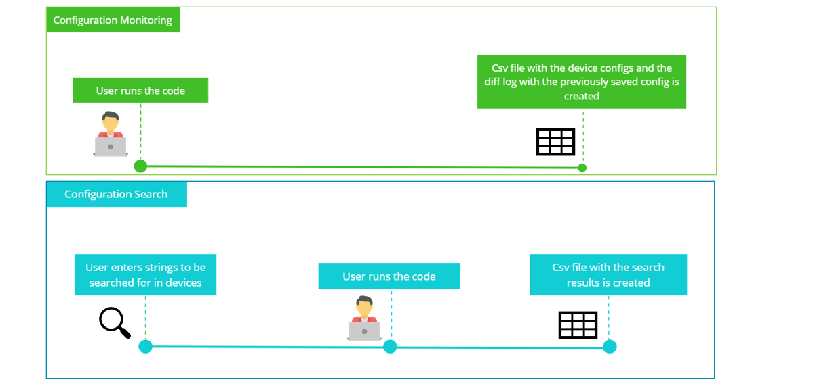

# Cisco DNA Center Configuration Monitoring

## Contacts
* Eda Akturk (eakturk@cisco.com)

## Solution Components
*  Python 3.8
*  Cisco DNA Center
    - [API Documentation](https://developer.cisco.com/docs/dna-center/#!cisco-dna-2-2-2-api-overview)


## Solution Overview
The solution consists of two parts:

- config_mon: allows users to save the current run config of devices in DNAC and evaluate the changes to the
device run configs in regards to the previously saved config. Users can search to see if a certain configuration such as the "ntp server" was changed in the devices.
- config_search: allows users to search the device config real-time for devices in DNAC. The solution will
generate a csv file with the devices containing the certain string(s) and the devices which do not.


## Installation/Configuration

1. Clone the repo :
```$ git clone (link)```

2. *(Optional) Create Virtual Environment :*
Initialize a virtual environment

```virtualenv venv```

3. *(Optional) Activate Virtual Environment :*

*Windows*   ``` venv\Scripts\activate```
*Linux* ``` source venv/bin/activate```

4. Install the libraries :

```$ pip install -r requirements.txt```


## Setup:

*DNA Center*
1. Add the DNA Center credentials in config.py
```
DNAC_URL=" "
USERNAME = " "
PASSWORD = " "
```

*Search in Configuration*

2. Enter the string(s) that you want to search for in the device configs to config_search.py.
You can add more strings by modifying the string_check(params) function in the same file.
```
search_string1 = "xxx"
search_string2 = "yyy"
```
If you would like to check for more strings you can add them to the "string_check" function on config_searh.py. Likewise you could remove the parameters to check for a single match.


*Filter Devices in Cisco DNA Center*

3. You can filter the devices that you would like to run code on. Go to "get_all_device_hostnames" on dnac_devices.py
Modify the script below. (Currently it only checks for the family of devices).
Additional parameters can be software version, location, software type etc. More options can be found on the Cisco DNA Center Devices API.
```
    for device in all_devices_info:
        if device['family'] == 'Switches and Hubs' or device['family'] == 'Routers':
            '''
            device['softwareType'] =  'IOS-XE'
            device['softwareVersion'] = '17.4.1b'
            device['locationName'] =  None
            device['location'] =  None
            '''
            all_devices_hostnames.append(device['hostname'])
```


## Usage

For configuration monitoring, run the config_mon.py file:
```
python config_mon.py
```
For string search, run the config_search.py file:
```
python config_search.py
```



Sample outputs can be found in the "OUTPUT" folder.

# Screenshots

### LICENSE

Provided under Cisco Sample Code License, for details see [LICENSE](LICENSE.md)

### CODE_OF_CONDUCT

Our code of conduct is available [here](CODE_OF_CONDUCT.md)

### CONTRIBUTING

See our contributing guidelines [here](CONTRIBUTING.md)

#### DISCLAIMER:
<b>Please note:</b> This script is meant for demo purposes only. All tools/ scripts in this repo are released for use "AS IS" without any warranties of any kind, including, but not limited to their installation, use, or performance. Any use of these scripts and tools is at your own risk. There is no guarantee that they have been through thorough testing in a comparable environment and we are not responsible for any damage or data loss incurred with their use.
You are responsible for reviewing and testing any scripts you run thoroughly before use in any non-testing environment.
